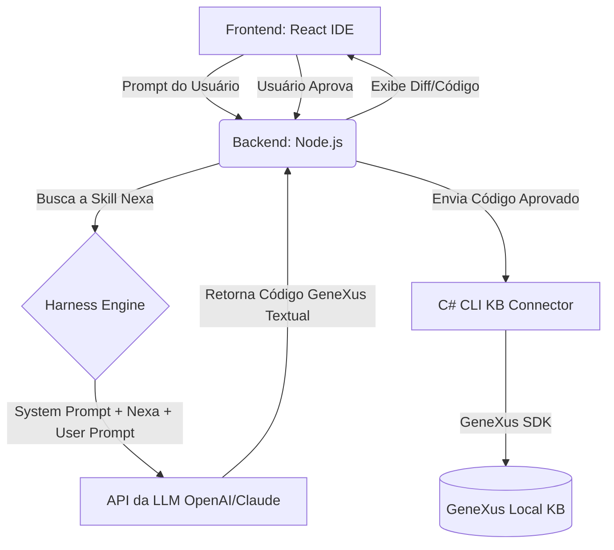

# Plano de Implementação: Mini IDE Genexus AI

A criação desta IDE focada em GeneXus visa fornecer um ambiente controlado onde o desenvolvedor possa solicitar alterações, revisar o código gerado por IA (usando a skill `nexa` como base de conhecimento) e aplicar essas alterações diretamente em uma Knowledge Base (KB) local.

## 🛠 Escolha Tecnológica (Fácil Manutenção)

Para garantir fácil manutenção e alinhamento com práticas modernas de desenvolvimento:

*   **Frontend**: **Vite + React** com **Vanilla CSS**.
    *   *Por quê?* React possui um ecossistema gigante, fácil de manter e achar soluções. Vite garante um build extremamente rápido. O uso de CSS puro (Vanilla) garante o controle total de um design premium e responsivo sem dependência de classes de frameworks terceiros. Integrar o `Monaco Editor` (motor do VS Code) no React para o visualizador de código é simples e bem documentado.
*   **Backend**: **Node.js com Express**.
    *   *Por quê?* É o melhor ecossistema para criar intermediários locais (APIs). O Node rodando localmente na máquina do desenvolvedor tem permissões para ler e escrever no sistema de arquivos, executar comandos de terminal (essencial para chamar o KB Connector) e integrar facilmente com as APIs de LLM (OpenAI, Anthropic, Ollama).

## 🧠 Abordagem para o KB Connector (Análise)

Ao avaliar a melhor forma de interagir com o GeneXus 18 (ou anterior), temos o desafio de que o formato nativo ensinado pela skill `nexa` é um texto declarativo conciso, mas o GeneXus 18 trabalha primariamente com arquivos XML (`.xpz`) ou interface visual.

*   **Alternativa 1: Fazer o LLM gerar o arquivo XML (.xpz) para importação.**
    *   *Desvantagem*: Gasto **astronômico** de tokens. O XML do GeneXus é verboso, complexo e repleto de IDs internos (GUIDs). A chance de a IA errar a sintaxe (alucinação) e corromper o import é quase 100%. Tempo de geração altíssimo.
*   **Alternativa 2: Usar o C# e GeneXus Platform SDK (A Escolha Ideal).**
    *   *Vantagem*: A LLM utilizará perfeitamente a skill `nexa`, gerando textos limpos e curtos (ex: `Transaction Customer { CustomerId* ... }`), consumindo o **mínimo de tokens** e garantindo altíssima assertividade.
    *   *Como funciona*: Criaremos um utilitário em linha de comando (CLI) feito em C#. O backend Node.js chamará esse utilitário passando o texto da LLM. O utilitário usa as APIs do GeneXus SDK para abrir a KB, interpretar o formato curto e criar os objetos programaticamente.

**Conclusão**: A Opção 2 (C# SDK) é disparada a melhor escolha considerando custo (tokens) e tempo (velocidade de inferência da IA).

---

## 🏗 Arquitetura do Sistema

## 🚀 Proposta de Fases de Desenvolvimento

### Fase 1: Fundação e Harness
*   Inicializar o projeto Frontend (Vite/React) e Backend (Node.js).
*   Construir a interface premium da IDE com painel de chat e editor de código (Monaco).
*   Baixar e integrar a skill `nexa` localmente.
*   Implementar a rota no backend que consome a LLM fornecendo a skill como System Prompt.

### Fase 2: Visualização e Controle (Diff)
*   Criar a interface de revisão, onde o usuário visualiza o que será criado/alterado antes de aprovar.

### Fase 3: Conexão com o GeneXus (KB Connector)
*   Criar o projeto console em C#.
*   Adicionar referências ao `Genexus.Server.API` e SDK.
*   Implementar a leitura e parsing do retorno do LLM para injetar e atualizar objetos na KB via código.

---

> [!IMPORTANT]  
> **User Review Required:**
> Por favor, revise as escolhas tecnológicas (React/Node.js/C#) e a estratégia do conector. Se você estiver de acordo com este plano e essa separação em fases, nós podemos começar imediatamente executando a **Fase 1** neste diretório.

## Open Questions

1.  Para a **Fase 1**, você já possui uma API Key da provedora de LLM (ex: OpenAI) disponível para testarmos a comunicação e geração da resposta com a skill `nexa`?
2. Gostaria que a interface (Frontend) rodasse de forma embutida via Electron/Tauri futuramente, ou podemos iniciar via Web no navegador local?
